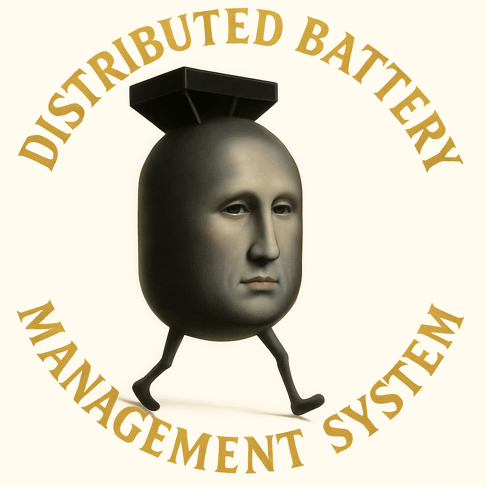

# DBMS2

This repository is part of the Distributed Battery Management System (DBMS) project, and contains the DBMS controller firmware.

DBMS is the in-house battery management system for the Texas A&M University Formula EV team.

## Releases

| Date | Version | Changelog | Testing |
| --- | --- | --- | --- |
| Jan 2026 | v3.1 | Charging improvements, auto-shutdown, etc. | 1/30/2026 |
| Jan 2026 | v3.0 | Prototype charging support for AME25 | n/a |
| Nov 2025 | v2.1 | Improvements to discharge path on AME 25 | 11/22/2025 |
| Oct 2025 | v2.0 | Implements full safe discharge path on AME 25 | 10/26/2025 |

## People

The firmware was written by

* [Justus Languell '27](https://www.linkedin.com/in/justusl/)
* [Cam Stone '26](https://www.linkedin.com/in/cameronwstone/)
* [Abhinav Akavaram '27](https://www.linkedin.com/in/abhinav-akavaram-a1a97225a/)
* [Eli Nicksic '27](https://www.linkedin.com/in/elinicksic/)

The hardware was designed and manufactured by 

* [Jeff Cunningham '26](https://www.linkedin.com/in/j-cunningham/)
* [Thomas Raguso '25](https://www.linkedin.com/in/tsraguso/)
* [Ryan Cummings '25](https://www.linkedin.com/in/ryan-cummings-4385b41b3/)
* [Anaya Zia '29](https://www.linkedin.com/in/anaya-zia-00a9b9380/)

